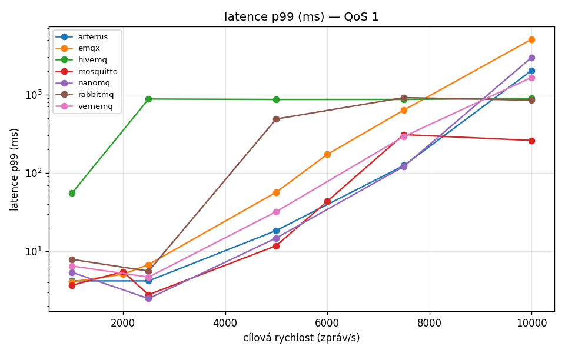
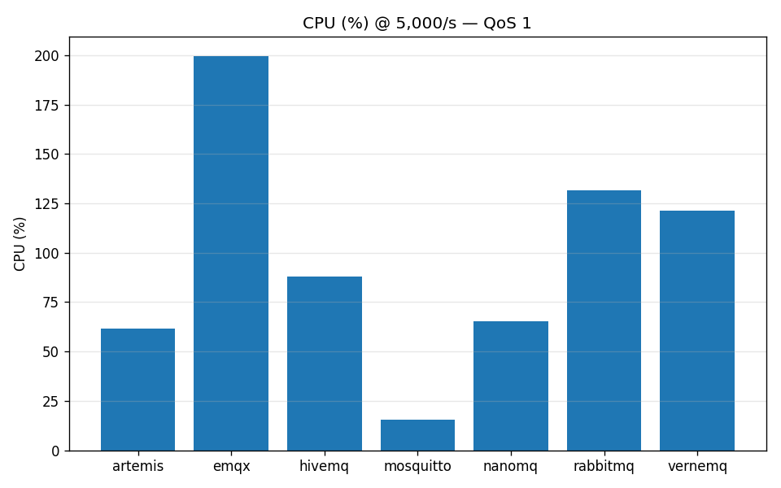

# IoT systém pro sběr senzorických dat v budovách

Modulární, škálovatelný distribuovaný systém pro **sběr, ukládání a zpřístupnění
dat z heterogenních senzorových jednotek** v budovách — se zaměřením na HVAC a
kvalitu vnitřního prostředí (teplota, vlhkost, CO₂, VOC, tlak).

> **Stav:** návrh architektury a backendu — semestrální projekt (**body 1–7**).
> Plán a postup viz [ROADMAP.md](ROADMAP.md), testovací strategie viz
> [TESTING.md](TESTING.md).

---

## O projektu

Cílem je obecná architektura, která umožní:

- **škálovatelnost** — stovky až tisíce jednotek bez přepisu systému,
- **modularitu senzorů** — jednotka = N kanálů (čidel); nový typ čidla bez změny schématu,
- **interoperabilitu** — jednotný kanonický datový model napříč různými payloady,
- **nasazení v různých budovách** — hierarchie tenant → budova → patro → místnost.

**Vzdálené řízení a chytré ukládání (návrh):**

- příkazy zařízení (start/stop měření, `measure_now`, restart, kalibrace, …),
- vzdálená konfigurace (interval měření, kalibrace),
- ukládací politika „report by exception" + heartbeat — ukládej při překročení
  prahu (s hysterezí), jinak periodicky,
- vynucení na zařízení (umí-li), jinak na backendu — viz
  [docs/design/rizeni-a-ukladaci-politika.md](docs/design/rizeni-a-ukladaci-politika.md).

**Vizualizace „digital twin" (návrh):**

- 2,5D přehled pater na sobě; po rozkliknutí patra 3D scéna se senzory v reálných pozicích,
- živé hodnoty barevně + klik na senzor → graf historie — viz
  [docs/design/3d-vizualizace-budovy.md](docs/design/3d-vizualizace-budovy.md).

## Architektura (přehled)

```
Senzory ──MQTT──> Broker ──> Ingestion ──> Time-series DB ─┐
                    │                       Metadata DB ────┼──> API ──> Dashboard
                    └── Device registry + konfigurace ──────┘
```

Detailní návrh (diagramy, datový model, protokol, registrace) je v
[ROADMAP.md](ROADMAP.md).

## Struktura repozitáře

| Složka | Obsah |
|---|---|
| `docs/` | rešerše, návrhové dokumenty, diagramy, ADR (rozhodnutí) |
| `infra/` | docker-compose, konfigurace brokeru, init DB |
| `backend/` | ingestion + device registry + API (vítězný stack) |
| `benchmarks/` | tenké ingestion služby kandidátů + výsledky srovnání |
| `simulator/` | sensor simulator / generátor zátěže |
| `dashboards/` | Grafana dashboardy (JSON) |
| `tests/` | testy (viz [TESTING.md](TESTING.md)) |

## Rozsah

- **Semestrální projekt:** body 1–7 (analýza, architektura, backend, vizualizace,
  protokol, registrace).
- **Navazující práce:** body 8–12 (HW jednotka, firmware, integrace cizích jednotek,
  experiment v reálném prostředí, publikace) — v dokumentaci značeno `[NAVAZUJÍCÍ]`.

## Jak spustit

Sdílená infrastruktura (Fáze 2) je hotová — broker (EMQX) + TimescaleDB + Grafana:

```bash
cd infra/
cp .env.example .env
docker compose up -d            # EMQX :1883 · Grafana :3000 · TimescaleDB :5432
```

Generátor zátěže (syntetická telemetrie):

```bash
cd simulator/
python -m venv .venv && source .venv/bin/activate && pip install -e .
python -m simulator --devices 2 --rate 1
```

Detaily a ověření v [infra/README.md](infra/README.md) a [simulator/README.md](simulator/README.md).

## Porovnání MQTT brokerů

Jako součást analýzy řešení (bod 2) bylo změřeno **7 MQTT brokerů** rampovým
benchmarkem (vlastní nástroj, generátor zátěže = simulátor). Detaily, grafy a
metodika v [benchmarks/brokers/](benchmarks/brokers/).

Srovnání při **5 000 zpráv/s, QoS 1** (medián ze 3 běhů):

| Broker | p99 | propust. | CPU | RAM |
|---|---:|---:|---:|---:|
| Mosquitto | **12 ms** | 5 000/s | **16 %** | 11 MB |
| NanoMQ | 15 ms | 5 000/s | 66 % | **8 MB** |
| Artemis | 18 ms | 5 000/s | 61 % | 674 MB |
| VerneMQ | 32 ms | 5 000/s | 122 % | 376 MB |
| EMQX | 57 ms | 5 000/s | 200 % | 249 MB |
| RabbitMQ | 488 ms | 5 000/s | 132 % | 268 MB |
| HiveMQ CE | 865 ms | **1 244/s** | 88 % | 603 MB |

**Závěr:** při QoS 0 zvládnou 5 000/s všichni; při QoS 1 se rozevřou nůžky
(durabilita vs. propustnost). **Mosquitto** je nejvyrovnanější (nejnižší CPU i
latence), **NanoMQ** nejmenší RAM.

Kromě výkonu byly změřeny i **spolehlivost při výpadku** (restart brokeru:
přežijí jen HiveMQ, VerneMQ, RabbitMQ, Artemis — persistují QoS1 na disk) a
**škálovatelnost spojení** (EMQX a NanoMQ čistě 10 000 spojení; Artemis na
škále spojení selhává). Detaily v [benchmarks/brokers/](benchmarks/brokers/).




Více grafů a metodika v [benchmarks/brokers/](benchmarks/brokers/).

**Testováno na:** Intel Core i5-12450HX (8 j / 12 vl), 23 GiB RAM, NVMe SSD,
Arch Linux (kernel 6.19), Docker 29.4 — vše na jednom hostu (čísla relativní,
viz výhrady v [benchmarks/brokers/README.md](benchmarks/brokers/README.md)).

## Dokumentace

- [ROADMAP.md](ROADMAP.md) — plán, fáze, návrh architektury / protokolu / datového modelu
- [TESTING.md](TESTING.md) — testovací strategie (funkčnost, zátěž, výpadky, latence)
- `docs/` — rešerše a rozhodnutí (ADR)

## Licence

MIT — viz [LICENSE](LICENSE).

## Autor

**Václav Vojtovič** — semestrální projekt.
