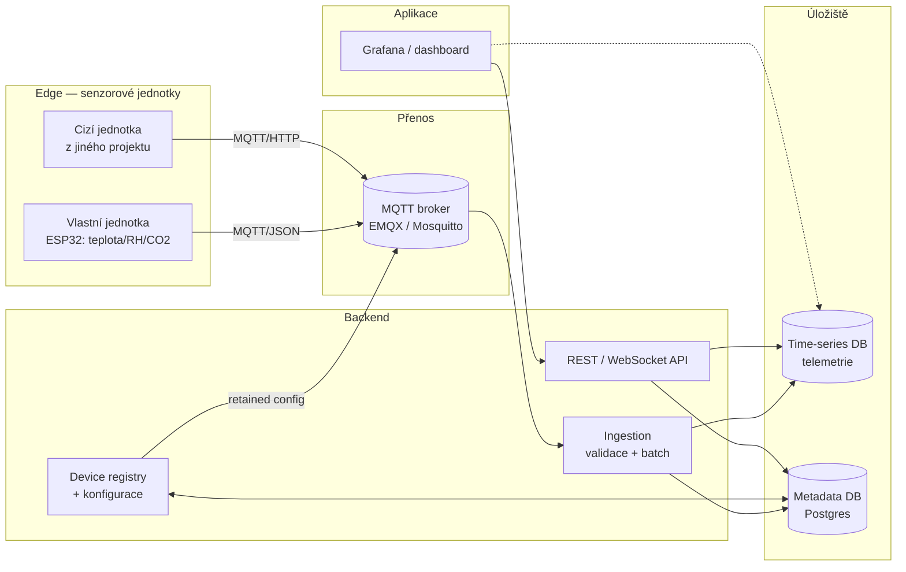
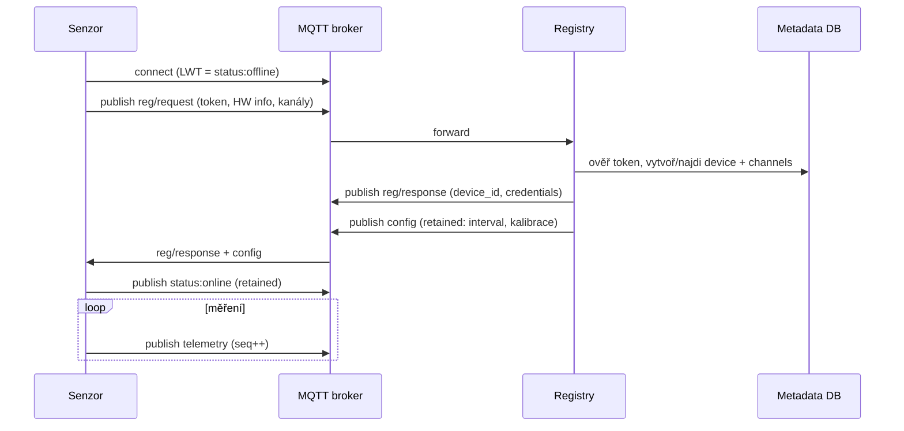

# ROADMAP — Distribuovaný IoT systém pro sběr senzorických dat v budovách

> Semestrální projekt řeší **body 1–7** zadání. Body 8–12 (HW jednotka, firmware,
> integrace cizích jednotek, experiment v reálném prostředí, publikace) jsou
> navazující práce — v roadmapě jsou označené `[NAVAZUJÍCÍ]`, ale architekturu
> navrhujeme tak, aby je už teď nebrzdila.
>
> Testovací strategie je v samostatném souboru [TESTING.md](TESTING.md).

---

## 1. Cíl a rozsah

**Cíl semestrálky:** navrhnout a zčásti implementovat **modulární, škálovatelnou
architekturu** pro sběr, ukládání a zpřístupnění dat z heterogenních senzorových
jednotek v budovách (HVAC / kvalita vnitřního prostředí — teplota, vlhkost, CO₂,
VOC, tlak).

Klíčové nefunkční vlastnosti (tahle čtyřka se line celým návrhem i testy):

| Vlastnost | Co konkrétně znamená | Kde se ověřuje |
|---|---|---|
| **Škálovatelnost** | stovky–tisíce jednotek, růst bez přepisu | benchmark + zátěžové testy |
| **Modularita senzorů** | jednotka = N kanálů (čidel), přidání typu čidla bez změny schématu | datový model (kanály), self-describing payload |
| **Interoperabilita formátů** | jednotný kanonický model, mapování různých payloadů | protokol + schema validace |
| **Nasaditelnost v různých budovách** | hierarchie tenant → budova → patro → místnost | datový model + registrace |

---

## 2. Klíčové rozhodnutí: stack jako experiment

Volbu backendového stacku řešíme **měřením, ne dohadem**. Aby to bylo zvládnutelné
za semestr:

- **Sdílená infrastruktura** (stejná pro všechny kandidáty): MQTT broker + time-series DB
  + metadata DB. Ta se nemění.
- V každém kandidátském stacku se napíše jen **minimální ingestion služba**
  (subscribe → parse → validace → batch insert) + jeden read endpoint.
- Porovnání **apples-to-apples** na stejném brokeru, stejné DB, stejné zátěži.
- Vítězný stack se pak dotáhne do plné implementace (Fáze 4–5).

Kandidáti a hypotézy (potvrdíš/vyvrátíš měřením):

| Stack | Proč ho zvážit | Riziko |
|---|---|---|
| **Python (FastAPI + asyncio-mqtt)** | rychlý vývoj, bohatý IoT ekosystém | nižší raw throughput (GIL) |
| **C# / .NET (MQTTnet + EF Core)** | domácí na Windows, výkon, Azure IoT | víc ceremonie |
| **Node.js (NestJS + mqtt.js)** | skvělé pro WebSocket/live dashboard | CPU-bound zpracování |
| **Java / Spring Boot** | enterprise standard, robustní | hodně boilerplate, paměť |

Kritéria rozhodnutí (váhy si zvol podle priorit školitele) — detailní metodika je
v [TESTING.md](TESTING.md#5-benchmark-stacků):

1. Max. udržitelný **throughput** (zpráv/s bez nárůstu fronty)
2. **Latence** end-to-end (p50/p95/p99)
3. **Spotřeba zdrojů** (CPU %, RAM, velikost image)
4. **Rychlost vývoje** (čas/řádky kódu na stejnou funkci)
5. **Zralost knihoven** a tvoje znalost stacku

> **Tip pro práci:** výsledný srovnávací graf + tabulka kritérií je samostatná
> kapitola do textu („Výběr implementační platformy") — vypadá to dobře a je to
> obhajitelné.

---

## 3. Cílová architektura



**Vrstvy / komponenty:**

| Komponenta | Odpovědnost | Bod zadání |
|---|---|---|
| Senzorová jednotka (edge) | sběr + odeslání, lokální buffer při výpadku | 8–9 `[NAVAZUJÍCÍ]` |
| MQTT broker | rozvoz zpráv, QoS, retained, LWT, ACL | 2, 6 |
| Ingestion služba | příjem, schema validace, dedup, dávkový zápis | 4 |
| Time-series DB | telemetrie (zápis-heavy, dotazy v čase) | 4 |
| Metadata DB | tenant/budova/místnost/zařízení/kanály/config | 4 |
| Device registry + config | registrace, identifikace, konfigurace jednotek | 7 |
| API (REST + WS) | čtení dat, správa zařízení, live stream | 4 |
| Vizualizace / monitoring | dashboardy, stav zařízení, alerty | 5 |

---

## 4. Fáze, milníky, deliverables

Odhady jsou v „person-týdnech" pro jednoho člověka. Namapuj si je na svůj deadline
(přidej rezervu ~20 %).

### Fáze 0 — Rešerše a analýza `(body 1, 2)` · ~2–3 týdny
- Architektury IoT (vrstvový model: perception / edge / network / platform / application).
- Doménová specifika: HVAC, kvalita vnitřního prostředí, normy a prahové hodnoty
  (CO₂, VOC, PM, EN 16798-1, ASHRAE) — kvůli smysluplným jednotkám a alertům.
- **Survey protokolů:** MQTT (3.1.1 vs 5.0), MQTT-SN, HTTP/REST, CoAP, UDP, AMQP,
  LoRaWAN — overhead, QoS, spotřeba, vhodnost pro constrained zařízení.
- **Survey platforem:** AWS IoT Core, Azure IoT Hub, ThingsBoard, FIWARE (NGSI-LD),
  EdgeX Foundry, Magistrala (ex-Mainflux) — co převzít, co je overkill.
- **Survey databází:** time-series (InfluxDB, TimescaleDB, QuestDB, VictoriaMetrics)
  vs relační (Postgres) vs NoSQL (MongoDB).
- **Deliverable:** požadavková specifikace (funkční + nefunkční), srovnávací tabulky,
  rozhodovací kritéria. → kapitola „Analýza / rešerše" do textu.
- **Definition of done:** umíš zdůvodnit volbu MQTT 5 + time-series DB v jedné větě každé.

### Fáze 1 — Návrh architektury, protokolu a registrace `(body 3, 6, 7)` · ~2–3 týdny
- High-level architektura (diagram výše), hranice komponent, datový tok.
- **Datový model** (návrh viz §5) — modularita přes kanály, hierarchie budov.
- **Komunikační protokol** (návrh viz §6) — MQTT topic taxonomie, schéma zpráv
  (telemetrie / status / registrace / config / command), QoS, retained, LWT, `seq`
  pro řazení a deduplikaci.
- **Identifikace / registrace / konfigurace** (návrh viz §7) — provisioning token,
  JIT registrace, doručení konfigurace přes retained topic (vzor „device shadow/twin").
- **Deliverable:** návrhové dokumenty, sekvenční diagramy (registrace, telemetrie,
  offline buffer & replay), ERD datového modelu, koncept OpenAPI, specifikace MQTT topiců.
- **Definition of done:** návrh projde „papírovým" review — dokážeš na diagramu ukázat,
  co se stane při výpadku brokeru i backendu.

### Fáze 2 — Sdílená infrastruktura `(základ pro bod 4)` · ~1 týden
- `docker-compose`: broker (EMQX/Mosquitto) + time-series DB + Postgres + Grafana.
- Struktura repozitáře, git, základní CI (lint + testy).
- **Sensor simulator / generátor zátěže** — publikuje syntetickou telemetrii,
  umí škálovat počet „zařízení", umí simulovat výpadek a replay. Je to reusable
  základ pro **všechny** testy → viz [TESTING.md](TESTING.md#4-sensor-simulator).
- **Definition of done:** `docker compose up` nastartuje stack; simulátor pošle
  zprávu, vidíš ji v brokeru.

### Fáze 3 — Benchmark stacků a výběr `(bod 4 + tvé „otestovat všechny")` · ~2–3 týdny
- Minimální ingestion + 1 read endpoint v 2–4 kandidátech.
- Spuštění benchmarku dle [TESTING.md §5](TESTING.md#5-benchmark-stacků).
- **Deliverable:** srovnávací tabulka + grafy, **ADR** (architecture decision record)
  s odůvodněním výběru.
- **Definition of done:** vybraný stack + zdokumentované proč.

### Fáze 4 — Plná implementace backendu `(body 4, 7)` · ~2–3 týdny
- Ingestion: validace proti schématu, dávkování, deduplikace (`device_id`+`seq`),
  ošetření chyb, backpressure.
- **Device registry + registrace/konfigurace** (bod 7): registrační API, vydání
  identity/credentials, verzování konfigurace, push configu na zařízení.
- REST API: dotazy na telemetrii (časové rozsahy, agregace), seznam/detail zařízení,
  poslední hodnoty; **WebSocket** pro live data.
- Autentizace: API klíče / JWT pro klienty, credentials + ACL pro zařízení na brokeru.
- Retence / downsampling (continuous aggregates / retention policy).
- **Definition of done:** simulátor → broker → ingestion → DB → API vrátí stejná data.

### Fáze 5 — Vizualizace, monitoring, správa `(bod 5)` · ~2 týdny
- Grafana dashboardy: telemetrie po budově/místnosti, zdraví zařízení.
- Správa zařízení: seznam, stav online/offline (přes LWT), push konfigurace, vyřazení.
- Monitoring systému: metriky brokeru, zpoždění ingestionu, velikost DB
  (Prometheus + Grafana).
- Alerty: práh CO₂, zařízení offline, zaostávající ingestion.
- **Definition of done:** na dashboardu vidíš živá data i kdo je offline; přijde alert.

### Fáze 6 — Integrace, ověření, dokumentace `(přechod k bodům 8–12)` · průběžně + ~1–2 týdny
- E2E ověření přes simulátor; základní testy zátěže / latence / výpadku
  ([TESTING.md](TESTING.md)).
- Technická dokumentace, README, diagramy, návod na nasazení.
- `[NAVAZUJÍCÍ]` reálný HW (8–9), integrace cizích jednotek (10), experiment
  v reálné budově (11), publikace na GitHub/LinkedIn (12).
- **Definition of done semestrálky:** systém běží přes `docker compose up`, je
  zdokumentovaný a body 1–7 jsou prokazatelně pokryté (viz §8).

---

## 5. Návrh datového modelu (skica)

Princip: **telemetrie** jde do time-series DB (zápisově náročná, dotazy přes čas),
**metadata** do relační DB (Postgres). Modularita = zařízení má N **kanálů**.

```
tenant(id, name)
  └─ site/budova(id, tenant_id, name, adresa, geo)
       └─ location/zóna(id, site_id, patro, místnost, name)
            └─ device(id, location_id, hw_type, fw_version, serial/mac,
                      status, last_seen, registered_at, config_version)
                 └─ channel(id, device_id, quantity[co2|temp|rh|voc|pres],
                            unit, min, max, calibration)         ← MODULARITA

telemetry(time, device_id, channel_id, value, quality)           ← TIME-SERIES DB
device_config(device_id, version, json_config, applied_at)       ← vč. report_policy
device_capabilities(device_id, json, updated_at)                 ← edge_policy, příkazy…
measurement_policy(device_id|channel_id, json, version, enforced_at: edge|backend)
command_log(cmd_id, device_id, cmd, args, issued_by, status, acked_at)
credential/api_key(...)        event/audit(...)
```

- **Modularita:** nový typ čidla = nový řádek v `channel`, žádná změna schématu.
- **Interoperabilita:** každý kanál nese kanonickou jednotku → různé payloady se
  mapují na jeden model (zvaž **SenML, RFC 8428** jako kanonický formát).
- **Multi-budova:** hierarchie tenant → site → location → device → channel.

---

## 6. Návrh protokolu (skica) `(bod 6)`

**Doporučení:** MQTT **5.0**, QoS 1 pro telemetrii, retained pro stav a config,
LWT pro detekci offline. (MQTT 5 přidává shared subscriptions = load-balancing
ingestionu, message expiry, reason codes.)

**Topic taxonomie** (device-centric, verzovaná):

| Topic | Směr | QoS | Retained | Účel |
|---|---|---|---|---|
| `v1/dev/{device_id}/telemetry` | uplink | 1 | ne | měření |
| `v1/dev/{device_id}/status` | uplink | 1 | **ano** | online/offline (LWT) |
| `v1/dev/{device_id}/reg/request` | uplink | 1 | ne | žádost o registraci |
| `v1/dev/{device_id}/reg/response` | downlink | 1 | ne | identita/credentials |
| `v1/dev/{device_id}/config` | downlink | 1 | **ano** | konfigurace |
| `v1/dev/{device_id}/cmd/{cmd}` | downlink | 1 | ne | příkaz |
| `v1/dev/{device_id}/ack` | uplink | 1 | ne | potvrzení |

**Schéma telemetrie (JSON, verzované):**

```json
{
  "schema": "v1",
  "device_id": "esp32-ab12cd",
  "ts": 1717490000,
  "seq": 10432,
  "measurements": [
    { "ch": "co2",  "v": 812,  "u": "ppm" },
    { "ch": "temp", "v": 23.4, "u": "Cel" },
    { "ch": "rh",   "v": 41.2, "u": "%RH" }
  ],
  "meta": { "fw": "1.2.0", "batt": 87 }
}
```

- `seq` = monotónní čítač → **řazení, deduplikace, detekce ztráty, replay** po výpadku.
- `ts` = čas vzniku na zařízení (kvůli offline bufferu); server si značí čas příjmu.
- Pro constrained zařízení zvaž binární payload (**CBOR / Protobuf** — viz **Sparkplug B**).

---

## 7. Registrace, identifikace, konfigurace (skica) `(bod 7)`



- **Identifikace:** stabilní `device_id` (UUID nebo z MAC); `serial` pro HW.
- **Provisioning:** registrační token (pre-shared) → JIT registrace na první připojení.
- **Konfigurace:** doručena přes **retained** topic `config` (vzor device shadow/twin);
  zařízení potvrdí `config_version` v `status`/`ack` → server pozná, že config sedí.
- **Bezpečnost:** per-device credentials + ACL na brokeru (zařízení smí jen své topiky).

---

## 7b. Řízení, příkazy a ukládací politika `(rozšíření bodů 4–7)`

Doplněk nad rámec původního zadání — vzdálené řízení senzorů, rozšířená konfigurace
a chytré ukládání. **Detailní specifikace:**
[docs/design/rizeni-a-ukladaci-politika.md](docs/design/rizeni-a-ukladaci-politika.md).

- **Příkazy (downlink):** `start`/`stop`, `measure_now`, `set_interval`, `set_policy`,
  `reboot`, `calibrate`, `identify`. Vzor command/ack s `cmd_id`, QoS 1 a expirací.
  **Příkaz = jednorázová akce (neretained)** vs. **konfigurace = žádaný stav (retained)**.
- **Konfigurace:** rozšířena o `sample_interval_s`, `report_policy` a `calibration`;
  zařízení potvrdí `config_version`.
- **Ukládací politika („report by exception" + heartbeat):** ulož při překročení
  prahu (s **hysterezí**) nebo změně o deadband, jinak aspoň 1× za heartbeat; nikdy
  častěji než `min_interval`. Řeší „neukládat celý den stejnou teplotu".
- **Kde se vynucuje:** definováno centrálně, **na zařízení pokud to umí**
  (`edge_policy`), jinak na **backendu**; backend vždy pojistka. Viz
  [ADR 0002](docs/adr/0002-vynuceni-ukladaci-politiky.md). Drží to modularitu a
  umožňuje integraci cizích jednotek (bod 10) bez zásahu do jejich firmwaru.
- **Mimo rozsah:** kamera / video stream (prozatím vynecháno).

---

## 8. Mapování bodů zadání → fáze (pro kontrolu pokrytí)

| Bod | Téma | Fáze | Hlavní deliverable |
|---|---|---|---|
| 1 | Studium architektur | 0 | rešeršní kapitola |
| 2 | Analýza řešení (MQTT/HTTP/LoRaWAN/cloud) | 0 | srovnávací tabulky |
| 3 | Obecná architektura | 1 | architektonický návrh + ERD |
| 4 | Backend (příjem, DB, API) | 3–4 | běžící backend + OpenAPI |
| 5 | Vizualizace, monitoring, správa | 5 | dashboardy + správa zařízení |
| 6 | Komunikační protokol | 1 | spec topiců + schéma zpráv |
| 7 | Identifikace/registrace/konfigurace | 1, 4 | registrační flow + API |
| 8–12 | HW, firmware, integrace, experiment, publikace | `[NAVAZUJÍCÍ]` | — |

---

## 9. Doporučený výchozí stack (než rozhodne benchmark)

| Vrstva | Doporučení | Alternativy |
|---|---|---|
| Broker | **EMQX** (dashboard, metriky, shared subs) | Mosquitto (lehčí), HiveMQ |
| Time-series DB | **TimescaleDB** (Postgres + hypertables) | InfluxDB, QuestDB |
| Metadata DB | **PostgreSQL** | (sdílí s TimescaleDB) |
| Vizualizace | **Grafana** | vlastní React dashboard |
| Monitoring | **Prometheus + Grafana** | broker dashboard |
| Orchestrace (dev) | **Docker Compose** | k8s `[NAVAZUJÍCÍ]` |

> TimescaleDB je často sweet spot pro studentský projekt: time-series výkon
> **i** relační metadata v jedné DB → jednodušší provoz.

---

## 10. Struktura repozitáře (návrh)

```
semestralka/
├─ docs/                 # rešerše, návrh, diagramy, ADR
├─ infra/                # docker-compose, konfigurace brokeru, init DB
├─ backend/              # ingestion + registry + API (vítězný stack)
├─ benchmarks/           # tenké ingestion služby kandidátů + výsledky
├─ simulator/            # sensor simulator / generátor zátěže
├─ dashboards/           # Grafana dashboardy (JSON)
├─ tests/                # viz TESTING.md
├─ ROADMAP.md
├─ TESTING.md
└─ README.md
```

---

## 11. Reference (osvědčené, reálné)

- **MQTT 5.0** (OASIS) · **MQTT-SN** · **CoAP** (RFC 7252)
- **SenML** (RFC 8428) — kanonický formát měření (JSON/CBOR)
- **Sparkplug B** (Eclipse) — payload + birth/death certifikáty = vzor pro registraci
- Platformy: **ThingsBoard**, **FIWARE/NGSI-LD**, **EdgeX Foundry**, **Magistrala**
- DB: **TimescaleDB**, **InfluxDB**, **QuestDB**, **VictoriaMetrics**
- Normy prostředí: **EN 16798-1**, **ASHRAE 62.1** (prahy CO₂/větrání)

---

## 12. Hlavní rizika

| Riziko | Dopad | Mitigace |
|---|---|---|
| Přebujení rozsahu (chceš stavět vše 4×) | nestihneš | benchmark = tenké služby, plný systém 1× |
| Zátěžové testy na laptopu nejdou „do tisíců" | slabá data o škálovatelnosti | více publisher procesů / cloud VM, popiš limity |
| Latence end-to-end zkreslená nesladěnými hodinami | nevěrohodná čísla | NTP / měření na jednom hostu, viz TESTING.md |
| Spoléhání na cloud platformu místo vlastního návrhu | nesplníš „vlastní návrh" | platformy jen jako referenci v rešerši |

---

*Detailní postup, jak co testovat (vč. výpadků, latence a škálovatelnosti), je v
[TESTING.md](TESTING.md).*
